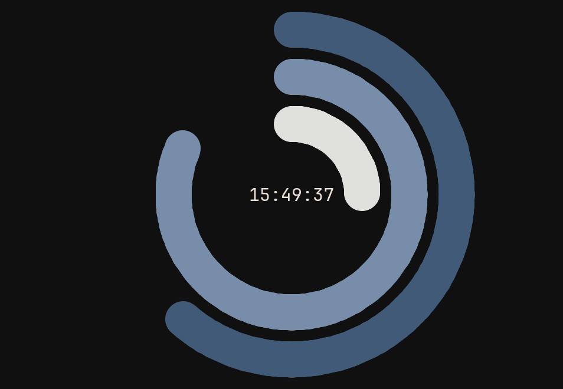

# Pygame Clock

 

A simple and fancy clock application built in Pygame. This project showcases the current time with a digital display and animated elements, offering a practical example of using Pygame for graphical applications.

